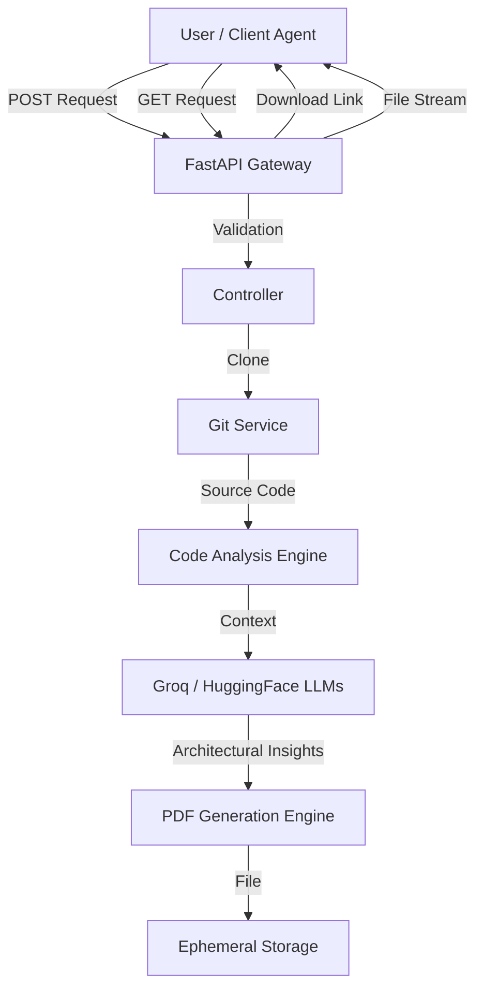

# System Architecture Document: Automated GitHub Architecture Generator

**Version:** 1.0.0  
**Date:** 2025-12-24  
**Service URL:** https://gitarch-production.up.railway.app/  

---

## 1. Executive Summary

The **System Architecture Generator API** is a specialized microservice designed to autonomously analyze GitHub repositories and generate comprehensive, professional software architecture documentation in PDF format. By leveraging advanced Large Language Models (LLMs) via **Groq** and **HuggingFace**, the service bridges the gap between raw code and high-level architectural understanding.

This document outlines the system's design, request workflows, API specifications, and integration strategies for multi-agent pipelines.

---

## 2. High-Level Architecture

The system operates as a stateless synchronous/asynchronous processing pipeline exposed via a RESTful API.

### 2.1 System Context Diagram



### 2.2 Core Components

1.  **API Layer (FastAPI)**:
    -   Handles incoming HTTP requests.
    -   Performs input validation (Pydantic models).
    -   Manages file uploads (PRD documents) and form data.

2.  **Git Integration Service**:
    -   Responsible for cloning public and private repositories.
    -   Handles authentication via Personal Access Tokens (PAT).
    -   Pre-processes file trees (ignoring locks, assets, etc.).

3.  **Intelligence Layer (AI Agents)**:
    -   **Provider**: Groq (primary inference) and HuggingFace.
    -   **Function**: Analyzes code structure, identifying patterns, tech stacks, and data flows to generate human-readable architectural descriptions.

4.  **Document Generation Engine**:
    -   Compiles analysis results into a structured format.
    -   Renders Markdown/HTML to PDF.
    -   Stores artifacts in a temporary directory (`/tmp` or similar).

---

## 3. Endpoints Specification

### 3.1 Base Information
-   **Root (`/api`)**: Returns service metadata or welcome message.
-   **Docs**: Auto-generated Swagger UI available at `/docs`.

### 3.2 Health Check (`/api/health`)
**Method:** `GET`  
**Purpose:** Verifies system operational status and dependent service connectivity.

**Response Structure:**
```json
{
  "status": "healthy",
  "service": "System Architecture Agent API",
  "version": "1.0.0",
  "environment": "development",
  "checks": {
    "groq_api_configured": true,
    "huggingface_api_configured": true,
    "pdf_directory_exists": true,
    "disk_space_available": true
  }
}
```

### 3.3 Generate Architecture (`/api/generate-github-architecture`)
**Method:** `POST`  
**Content-Type:** `multipart/form-data`  
**Purpose:** Triggers the analysis and generation process.

**Parameters:**
| Parameter | Type | Required | Description |
| :--- | :--- | :--- | :--- |
| `github_link` | String | Yes | Full URL of the GitHub repository. |
| `github_token` | String | No | PAT for accessing private repositories. |
| `prd_document` | File | No | Uploaded PRD (PDF/Text) to provide context. |

**Success Response (200 OK):**
```json
{
  "success": true,
  "message": "PDF generated successfully",
  "pdf_filename": "project_arch_123.pdf",
  "pdf_url": "/api/download/project_arch_123.pdf"
}
```

### 3.4 Download Artifact (`/api/download/{filename}`)
**Method:** `GET`  
**Purpose:** Retrieves the generated PDF file.
**Parameters:**
-   `filename`: The filename returned by the generation endpoint.

**Response:** Binary File Stream (`application/pdf`).

---

## 4. Operational Workflows

### 4.1 Request Lifecycle
1.  **Initiation**: Client submits `github_link` and optional `prd_document` via `POST`.
2.  **Ingestion**: Server validates inputs and temporarily saves the PRD.
3.  **Processing**:
    -   Server clones the target repository to a sandbox environment.
    -   Source code is indexed and chunked.
    -   Prompts are constructed for the LLM (Groq) to extract "System Overview", "Database Schema", and "API Definitions".
4.  **Synthesis**: LLM outputs are aggregated.
5.  **Rendering**: The aggregated content is formatted into a PDF.
6.  **Completion**: Server responds with a download URL.
7.  **Retrieval**: Client requests the specific file via `GET`.

### 4.2 Rate Limiting & Security
-   **Current State**: Development mode.
-   **Authentication**: No API key currently required for the service itself (Open Access).
-   **Repository Auth**: User-provided GitHub Tokens are used ephemerally and not stored.
-   **Rate Limits**: Bound by Railway platform limits and upstream API (Groq/GitHub) quotas.

---

## 5. Integration Guide: Multi-Agent Pipeline

To integrate this service into a larger automation pipeline (e.g., an automated dev shop), treating it as a **Tool** is recommended.

### 5.1 Tool Definition (JSON Schema)

```json
{
  "name": "generate_system_architecture",
  "description": "Analyzes a GitHub repo and returns a URL to a PDF architecture document.",
  "parameters": {
    "type": "object",
    "properties": {
      "repository_url": {
        "type": "string",
        "description": "The https URL of the git repo."
      },
      "github_token": {
        "type": "string",
        "description": "access token if repo is private"
      }
    },
    "required": ["repository_url"]
  }
}
```

### 5.2 Implementation Example (Python)

```python
import requests

API_BASE = "https://gitarch-production.up.railway.app"

def get_architecture_pdf(repo_url, token=None):
    # 1. Trigger Generation
    payload = {"github_link": repo_url}
    if token:
        payload["github_token"] = token
        
    print("Analyzing repository...")
    response = requests.post(f"{API_BASE}/api/generate-github-architecture", data=payload)
    response.raise_for_status()
    
    data = response.json()
    if not data.get("success"):
        raise Exception(f"Generation failed: {data.get('message')}")
        
    # 2. Download File
    pdf_url = data["pdf_url"]
    download_link = f"{API_BASE}{pdf_url}"
    print(f"Downloading from {download_link}...")
    
    pdf_resp = requests.get(download_link)
    filename = data["pdf_filename"]
    
    with open(filename, "wb") as f:
        f.write(pdf_resp.content)
        
    return filename
```

---

## 6. Future Recommendations
1.  **Async Webhooks**: For large repositories, analysis may time out synchronous HTTP requests. Implementing a webhook callback system is recommended for production scaling.
2.  **Caching**: Implement Redis caching for recently analyzed same-commit repositories to save LLM tokens.
3.  **Auth**: Introduce API Keys for the service itself to prevent unauthorized usage.
